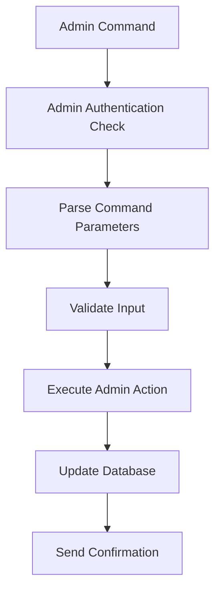

# Telegram Marketing Bot

A powerful Telegram bot for broadcasting messages to all registered users with enhanced features including GramJS integration for personal account messaging.

## 📋 Table of Contents

- [Project Overview](#project-overview)
- [Architecture & File Structure](#architecture--file-structure)
- [Data Flow Diagrams](#data-flow-diagrams)
- [Command Reference](#command-reference)
- [Database Schema](#database-schema)
- [Environment Configuration](#environment-configuration)
- [Installation & Setup](#installation--setup)
- [Development](#development)
- [Production Deployment](#production-deployment)
- [API Documentation](#api-documentation)

## 🎯 Project Overview

The Telegram Marketing Bot is a comprehensive messaging solution that allows administrators to broadcast messages to all registered users. It features:

- **Dual Messaging System**: Bot API for basic messaging + GramJS for personal account messaging
- **Admin Management**: Secure admin system with role-based access control
- **Media Support**: Full support for all Telegram media types (photos, videos, documents, etc.)
- **Retry Mechanism**: Automatic retry for failed message deliveries
- **Progress Tracking**: Real-time progress updates during bulk messaging
- **Security**: Secure OTP handling and session management

## 🏗️ Architecture & File Structure

```
Telegram-Marketing-Bot/
├── 📁 src/                          # Main source code
│   ├── 📁 commend/                  # Command handlers
│   │   ├── 📄 basic.ts             # Basic commands (/start, /help)
│   │   ├── 📄 send.ts              # Send command and message flow
│   │   ├── 📄 admin.ts             # Admin management commands
│   │   └── 📄 gramjs.ts            # GramJS setup and authentication
│   ├── 📁 database/                 # Database layer
│   │   ├── 📄 config.ts            # MongoDB connection configuration
│   │   └── 📁 models/              # Database models
│   │       ├── 📄 User.ts          # User model for recipients
│   │       ├── 📄 AdminUser.ts     # Admin user model
│   │       └── 📄 Chat.ts          # Chat model (if needed)
│   ├── 📁 middleware/               # Middleware functions
│   │   └── 📄 adminAuth.ts         # Admin authentication middleware
│   ├── 📁 utils/                    # Utility functions
│   │   ├── 📄 gramjsClient.ts      # GramJS client management
│   │   └── 📄 otpSessions.ts       # OTP session management
│   ├── 📁 controllers/              # API controllers
│   │   └── 📄 AuthControllers.ts   # Authentication controllers
│   ├── 📄 index.ts                 # Main bot entry point
│   ├── 📄 index_long_polling.ts    # Long polling mode
│   ├── 📄 index_webhook_express.ts # Webhook mode with Express
│   ├── 📄 start_server_prod.ts     # Production server startup
│   ├── 📄 env.ts                   # Environment configuration
│   └── 📄 constant.ts              # Constants and configurations
├── 📁 api/                          # API endpoints
│   └── 📄 bot.ts                   # API route handlers
├── 📁 scripts/                      # Utility scripts
│   ├── 📄 addFirstAdmin.ts         # Add first admin script
│   └── 📄 gramjsAuth.ts            # GramJS authentication script
├── 📄 package.json                  # Dependencies and scripts
├── 📄 tsconfig.json                # TypeScript configuration
├── 📄 Dockerfile                   # Docker configuration
├── 📄 docker-compose.prod.yml      # Production Docker setup
└── 📄 vercel.json                  # Vercel deployment config
```

## 🔄 Data Flow Diagrams

### 1. Bot Initialization Flow

```mermaid
graph TD
    A[Start Bot] --> B[Load Environment Variables]
    B --> C[Connect to MongoDB]
    C --> D[Initialize Bot Instance]
    D --> E[Register Command Handlers]
    E --> F[Set Bot Commands]
    F --> G[Start Bot (Long Polling/Webhook)]
    G --> H[Bot Ready]
```

**File Connections:**
- `src/index.ts` → `src/env.ts` → `src/database/config.ts`
- `src/index.ts` → `src/commend/*.ts` (all command handlers)
- `src/index.ts` → `src/middleware/adminAuth.ts`

### 2. Send Command Data Flow

```mermaid
graph TD
    A[/send Command] --> B[Admin Authentication Check]
    B --> C[Set User State: awaiting_message]
    C --> D[User Sends Message]
    D --> E[Extract Message Content & Type]
    E --> F[Store in User State]
    F --> G[Show Confirmation UI]
    G --> H[User Confirms]
    H --> I[Get All Users from Database]
    I --> J[Check GramJS Availability]
    J --> K[Download Media Files]
    K --> L[Send Messages in Batches]
    L --> M[Track Progress & Retry Failed]
    M --> N[Send Final Report]
    N --> O[Clean Up User State]
```

**File Connections:**
- `src/commend/send.ts` → `src/middleware/adminAuth.ts`
- `src/commend/send.ts` → `src/database/models/User.ts`
- `src/commend/send.ts` → `src/database/models/AdminUser.ts`
- `src/commend/send.ts` → `src/utils/gramjsClient.ts`
- `src/commend/send.ts` → `src/env.ts`

### 3. GramJS Setup Flow

```mermaid
graph TD
    A[/gramjs_setup] --> B[Check Existing Configuration]
    B --> C[Set Setup State: awaiting_api_id]
    C --> D[User Enters API ID]
    D --> E[Validate & Store API ID]
    E --> F[Set State: awaiting_api_hash]
    F --> G[User Enters API Hash]
    G --> H[Validate & Store API Hash]
    H --> I[Set State: awaiting_phone]
    I --> J[User Enters Phone Number]
    J --> K[Validate Phone Format]
    K --> L[Save Configuration to Database]
    L --> M[Setup Complete]
```

**File Connections:**
- `src/commend/gramjs.ts` → `src/database/models/AdminUser.ts`
- `src/commend/gramjs.ts` → `src/utils/gramjsClient.ts`

### 4. GramJS Authentication Flow

```mermaid
graph TD
    A[/gramjs_authenticate] --> B[Get Admin Configuration]
    B --> C[Create GramJS Client]
    C --> D[Start Authentication Process]
    D --> E[Send Verification Code]
    E --> F[Create Secure OTP Session]
    F --> G[User Enters Code via Web Form]
    G --> H[Verify Code]
    H --> I{2FA Enabled?}
    I -->|Yes| J[Request 2FA Password]
    I -->|No| K[Complete Authentication]
    J --> L[User Enters Password via Web Form]
    L --> M[Verify Password]
    M --> K
    K --> N[Save Session to Database]
    N --> O[Mark GramJS as Active]
```

**File Connections:**
- `src/commend/gramjs.ts` → `src/database/models/AdminUser.ts`
- `src/commend/gramjs.ts` → `src/utils/gramjsClient.ts`
- `src/commend/gramjs.ts` → `api/bot.ts` (OTP sessions)
- `src/utils/gramjsClient.ts` → `telegram` library

### 5. Admin Management Flow



**File Connections:**
- `src/commend/admin.ts` → `src/middleware/adminAuth.ts`
- `src/commend/admin.ts` → `src/database/models/AdminUser.ts`

## 📝 Command Reference

### Basic Commands

#### `/start`
- **Purpose**: Welcome new users and show available commands
- **Access**: All users
- **Data Flow**: `src/commend/basic.ts` → User receives welcome message
- **No Database Operations**

#### `/help`
- **Purpose**: Show detailed help information
- **Access**: All users
- **Data Flow**: `src/commend/basic.ts` → User receives help message
- **No Database Operations**

### Admin Commands

#### `/send`
- **Purpose**: Send message to all registered users
- **Access**: Admin users only
- **Data Flow**: 
  1. `src/commend/send.ts` → `src/middleware/adminAuth.ts` (auth check)
  2. `src/commend/send.ts` → `src/database/models/User.ts` (get users)
  3. `src/commend/send.ts` → `src/database/models/AdminUser.ts` (check GramJS)
  4. `src/commend/send.ts` → `src/utils/gramjsClient.ts` (send messages)
- **Database Operations**: Read users, check admin GramJS status

#### `/addadmin <user_id>`
- **Purpose**: Add a new admin user
- **Access**: Admin users only
- **Data Flow**: `src/commend/admin.ts` → `src/middleware/adminAuth.ts` → `src/database/models/AdminUser.ts`
- **Database Operations**: Insert/update admin user

#### `/removeadmin <user_id>`
- **Purpose**: Remove admin access from a user
- **Access**: Admin users only
- **Data Flow**: `src/commend/admin.ts` → `src/middleware/adminAuth.ts` → `src/database/models/AdminUser.ts`
- **Database Operations**: Update admin user (set isActive: false)

#### `/listadmins`
- **Purpose**: List all active administrators
- **Access**: Admin users only
- **Data Flow**: `src/commend/admin.ts` → `src/middleware/adminAuth.ts` → `src/database/models/AdminUser.ts`
- **Database Operations**: Query active admins

#### `/adminhelp`
- **Purpose**: Show admin-specific help information
- **Access**: Admin users only
- **Data Flow**: `src/commend/admin.ts` → `src/middleware/adminAuth.ts`
- **No Database Operations**

### GramJS Commands

#### `/gramjs_setup`
- **Purpose**: Configure GramJS for personal account messaging
- **Access**: Admin users only
- **Data Flow**: 
  1. `src/commend/gramjs.ts` → `src/middleware/adminAuth.ts`
  2. `src/commend/gramjs.ts` → `src/database/models/AdminUser.ts`
- **Database Operations**: Update admin user with GramJS credentials

#### `/gramjs_authenticate`
- **Purpose**: Complete GramJS authentication process
- **Access**: Admin users only
- **Data Flow**:
  1. `src/commend/gramjs.ts` → `src/middleware/adminAuth.ts`
  2. `src/commend/gramjs.ts` → `src/database/models/AdminUser.ts`
  3. `src/commend/gramjs.ts` → `src/utils/gramjsClient.ts`
  4. `src/commend/gramjs.ts` → `api/bot.ts` (OTP sessions)
- **Database Operations**: Update admin user with session data

#### `/gramjs_test`
- **Purpose**: Test GramJS connection
- **Access**: Admin users only
- **Data Flow**: `src/commend/gramjs.ts` → `src/utils/gramjsClient.ts`
- **Database Operations**: Read admin user GramJS status

#### `/gramjs_status`
- **Purpose**: Check GramJS configuration status
- **Access**: Admin users only
- **Data Flow**: `src/commend/gramjs.ts` → `src/database/models/AdminUser.ts`
- **Database Operations**: Read admin user GramJS configuration

#### `/gramjs_reset`
- **Purpose**: Reset GramJS configuration
- **Access**: Admin users only
- **Data Flow**: `src/commend/gramjs.ts` → `src/database/models/AdminUser.ts`
- **Database Operations**: Remove GramJS data from admin user

## 🗄️ Database Schema

### User Collection
```typescript
{
  userId: string,        // Telegram user ID (unique)
  // Collection name: configurable via USER_COLLECTION_NAME env var
}
```

### AdminUser Collection
```typescript
{
  userId: string,        // Telegram user ID (unique)
  username?: string,     // Telegram username
  firstName?: string,    // User's first name
  lastName?: string,     // User's last name
  isActive: boolean,     // Whether admin is active
  addedAt: Date,         // When admin was added
  addedBy?: string,      // Who added this admin
  // GramJS fields
  gramjsSession?: string,        // GramJS session string
  gramjsApiId?: number,          // Telegram API ID
  gramjsApiHash?: string,        // Telegram API Hash
  gramjsPhoneNumber?: string,    // Phone number
  gramjsSetupAt?: Date,          // Setup timestamp
  gramjsActive: boolean,         // Whether GramJS is active
}
```

## ⚙️ Environment Configuration

Required environment variables in `src/env.ts`:

```typescript
{
  // Telegram Bot Configuration
  TELEGRAM_BOT_TOKEN: string,    // Bot token from @BotFather
  API_ID: string,                // Telegram API ID
  API_HASH: string,              // Telegram API Hash
  
  // Database Configuration
  MONGODB_URI: string,           // MongoDB connection string
  DATABASE_NAME: string,         // Database name
  USER_COLLECTION_NAME: string,  // User collection name
  
  // Server Configuration
  NODE_ENV: 'development' | 'production' | 'test',
  PORT: number,                  // Server port (default: 3000)
  SERVER_URL?: string,           // Server URL for webhooks
  
  // Logging Configuration
  LOG_LEVEL: 'error' | 'warn' | 'info' | 'debug'
}
```

## 🚀 Installation & Setup

### Prerequisites
- Node.js 18+ 
- MongoDB database
- Telegram Bot Token (from @BotFather)
- Telegram API credentials (for GramJS)

### Installation Steps

1. **Clone the repository**
   ```bash
   git clone <repository-url>
   cd Telegram-Marketing-Bot
   ```

2. **Install dependencies**
   ```bash
   npm install
   ```

3. **Set up environment variables**
   ```bash
   cp .env.example .env
   # Edit .env with your configuration
   ```

4. **Set up database**
   ```bash
   # Ensure MongoDB is running
   # The bot will automatically create collections
   ```

5. **Add first admin**
   ```bash
   npm run add-admin
   # Follow prompts to add first administrator
   ```

6. **Start development server**
   ```bash
   npm run dev
   ```

## 🛠️ Development

### Available Scripts

```json
{
  "dev": "NODE_ENV=development tsx watch src/index_long_polling.ts",
  "dev:webhook": "NODE_ENV=development tsx watch src/index_webhook_express.ts",
  "build": "tsc",
  "start": "node build/src/index_long_polling.js",
  "start:webhook": "node build/src/index_webhook_express.js",
  "add-admin": "tsx scripts/addFirstAdmin.ts",
  "gramjs-auth": "tsx scripts/gramjsAuth.ts"
}
```

### Development Workflow

1. **Long Polling Mode** (Development)
   ```bash
   npm run dev
   ```

2. **Webhook Mode** (Production)
   ```bash
   npm run dev:webhook
   ```

3. **Add Admin**
   ```bash
   npm run add-admin
   ```

4. **GramJS Authentication**
   ```bash
   npm run gramjs-auth
   ```

## 🚀 Production Deployment

### Docker Deployment

1. **Build Docker image**
   ```bash
   npm run docker:build
   ```

2. **Run with Docker Compose**
   ```bash
   npm run docker:prod
   ```

3. **View logs**
   ```bash
   npm run docker:logs
   ```

### Vercel Deployment

The project includes `vercel.json` for easy deployment to Vercel:

```json
{
  "version": 2,
  "builds": [
    {
      "src": "src/index_webhook_express.ts",
      "use": "@vercel/node"
    }
  ],
  "routes": [
    {
      "src": "/(.*)",
      "dest": "src/index_webhook_express.ts"
    }
  ]
}
```

## 📚 API Documentation

### OTP Session Endpoints

The bot includes secure OTP handling for GramJS authentication:

- `POST /api/create-otp-session` - Create secure OTP session
- `GET /api/otp-status/:sessionId` - Check OTP submission status
- `POST /api/submit-otp/:sessionId` - Submit OTP securely

### Health Check Endpoints

- `GET /health` - Bot health status
- `GET /health/db` - Database health status

## 🔒 Security Features

1. **Admin Authentication**: All admin commands require authentication
2. **Secure OTP Handling**: OTP codes entered via secure web forms
3. **Session Management**: GramJS sessions stored securely
4. **Input Validation**: All user inputs validated and sanitized
5. **Rate Limiting**: Built-in rate limiting for message sending
6. **Error Handling**: Comprehensive error handling and logging

## 📊 Monitoring & Logging

The bot includes comprehensive logging:

- **Command Usage**: All commands logged with user context
- **Error Tracking**: Detailed error logging with stack traces
- **Performance Metrics**: Message sending progress and timing
- **Database Health**: Connection status and performance monitoring

## 🤝 Contributing

1. Fork the repository
2. Create a feature branch
3. Make your changes
4. Add tests if applicable
5. Submit a pull request

## 📄 License

This project is licensed under the ISC License.

## 🆘 Support

For support and questions:
- Check the documentation in `/docs` folder
- Review the setup guides in the root directory
- Contact the development team

---

**Note**: This bot is designed for legitimate marketing purposes. Ensure compliance with Telegram's Terms of Service and applicable laws when using this bot. 